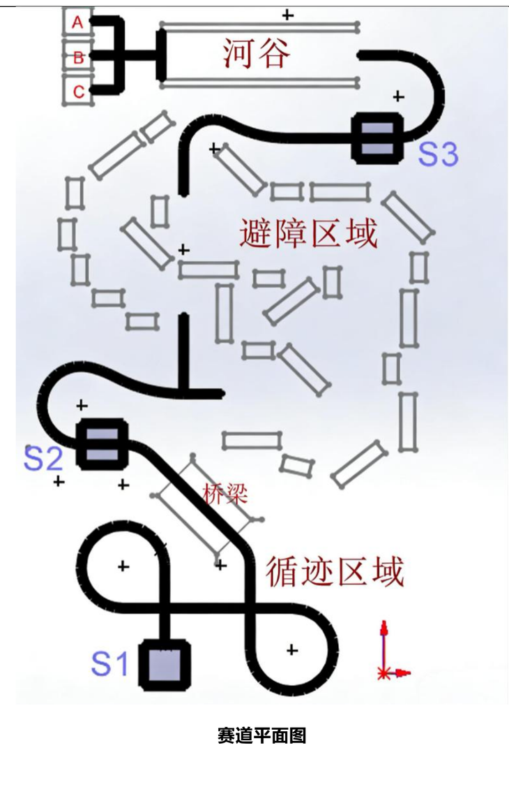
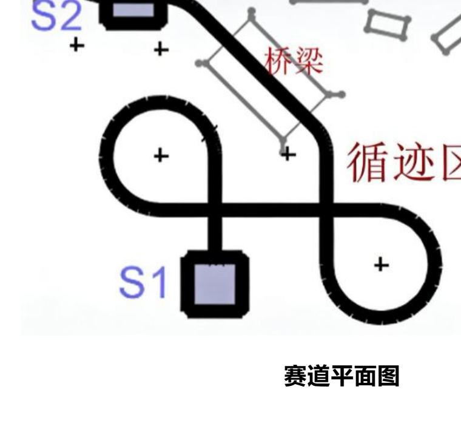
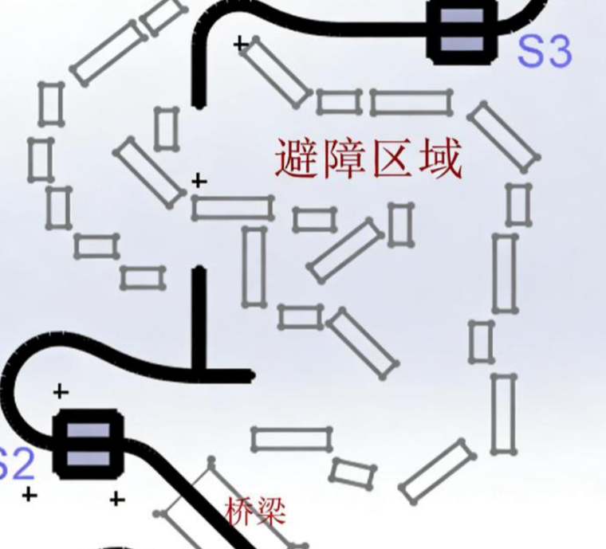
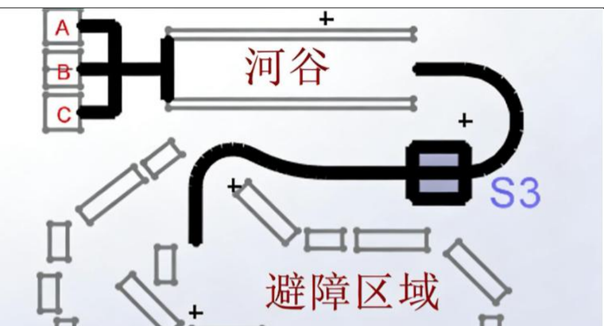

# YuYuan Rover

第十二届驭远杯智能小车项目。小车运行在 Raspberry Pi 平台上，需要在综合赛道中完成起点目标识别、循迹、路口计数、避障、河谷窄路通过和终点卸货。

项目核心是一个分段状态机：把完整比赛路线拆成若干个可调试阶段，并用红外、超声波、摄像头和舵机共同完成任务。

<p align="center">
  
</p>

## 任务目标

比赛路线不是单一循迹任务，而是由多个连续子任务组成：

1. 在 `S1` 起点读取 AprilTag，确定本轮货物需要投放到 A/B/C 哪个位置。
2. 沿黑线循迹，通过十字路口计数判断当前位置。
3. 在中段处理 T 字路口和障碍区域。
4. 在避障后重新接回路线，并进入 `S3` 后的河谷段。
5. 在较窄路线中降低转向幅度，稳定驶向卸货区。
6. 根据起点识别到的目标编号调整方向并完成卸货。

更完整的路线说明见 [docs/TRACK_ROUTE.md](docs/TRACK_ROUTE.md)。

## 赛道分区

### 起点识别与循迹区域



小车从 `S1` 出发，先用摄像头读取 AprilTag，得到 `target_id`。随后进入基础循迹区域，使用四路红外传感器判断黑线位置，并通过十字路口计数推进任务阶段。

### 障碍与接回路线区域



中段路线包含障碍区域。程序通过前方、左侧、右侧超声波传感器读取距离：第一次遇到障碍时执行固定绕行动作，之后根据左右距离微调方向，并在重新检测到路线特征后进入下一阶段。

### 河谷与卸货区域



河谷段对转向过冲更敏感，所以代码单独设置了更柔和的左右轮速度差。到达卸货区后，小车根据起点识别得到的 A/B/C 目标，决定是否调整车身方向，再驱动舵机完成投放。

## 控制系统设计

主程序位于 [src/rover_main.py](src/rover_main.py)。整体结构分为五层：

| 模块 | 作用 |
| --- | --- |
| 全局配置 | 串口、GPIO 引脚、速度参数、超声波阈值、十字路口去抖阈值 |
| 状态持久化 | 用 `mission_state.json` 保存 `startpoint`、`target_id`、`flag`、`num_cross` |
| 硬件抽象 | 封装电机串口控制、舵机 PWM、超声波测距 |
| 感知与基础动作 | AprilTag 识别、红外读数、十字路口检测、通用循迹 |
| 主状态机 | 按赛道阶段调度循迹、T 字路口处理、避障、河谷和卸货 |

核心状态变量：

- `flag`：当前任务阶段。
- `num_cross`：已经经过的十字路口数量。
- `target_id`：起点识别得到的卸货目标。
- `startpoint`：用于从 `S1`、`S2`、`S3` 检查点恢复。

状态机阶段：

| flag | 阶段 | 控制策略 |
| --- | --- | --- |
| `1` | 初始循迹 | 基础红外循迹，累计十字路口 |
| `2` | 中段循迹 | 处理 T 字路口，等待障碍触发 |
| `3` | 避障接回 | 超声波触发绕行，再寻找路线接回 |
| `4` | 河谷段 | 使用更小速度差稳定通过窄路 |
| `5` | 终点卸货 | 根据 `target_id` 调整方向并控制舵机 |

## 关键实现

### 十字路口去抖

红外传感器经过十字路口时，可能连续多帧都读到全黑。如果每帧都计数，状态机会误跳。代码用 `CROSS_DETECT_THRESHOLD` 和 `junction_locked` 组合实现去抖：连续检测到路口才计一次，离开该路口后才允许下一次计数。

### 状态恢复

调试比赛小车时，经常需要从中段继续跑。程序会把任务状态写入 `mission_state.json`，包括目标编号、当前阶段和路口计数。这样从 `S2` 或 `S3` 恢复时，不需要重新执行完整路线。

### 避障与路线接回

避障阶段先使用前方超声波检测障碍，触发一段固定绕行动作；随后用左右超声波距离判断哪一侧空间更大，并通过红外传感器判断是否重新接回黑线。

### 河谷段柔和控制

普通循迹的内外轮速度差较大，适合快速纠偏；河谷段更窄，过度修正会导致摆动。因此 `flag == 4` 时使用独立速度表，让小车以更小的左右轮差值行驶。

## 硬件与依赖

目标运行环境：

- Raspberry Pi
- Raspberry Pi Camera
- 串口底盘控制器
- 四路红外循迹传感器
- 三个超声波传感器
- 舵机卸货机构

Python 依赖：

```bash
pip install -r requirements.txt
```

其中 `picamera2`、`lgpio` 等依赖通常需要在 Raspberry Pi OS 上安装。普通电脑可以做静态检查，但不能直接运行完整任务。

## 运行方式

完整运行：

```bash
python src/rover_main.py
```

重置任务状态后从 `S1` 开始：

```bash
rm -f mission_state.json
python src/rover_main.py
```

从检查点恢复时，可以手动编辑 `mission_state.json`：

```json
{
  "startpoint": "S2",
  "target_id": 0,
  "flag": 2,
  "num_cross": 8
}
```

## 文件结构

```text
.
├── src/
│   └── rover_main.py              # 最终主程序
├── manual_tests/                  # 底盘、循迹、避障、摄像头等单功能测试
├── experiments/                   # 历史版本和组合实验代码
├── docs/
│   ├── TRACK_ROUTE.md             # 图文版赛道路线说明
│   ├── PROJECT_AUDIT.md           # 整理过程和文件取舍说明
│   └── assets/                    # README 和文档配图
├── requirements.txt
└── README.md
```

