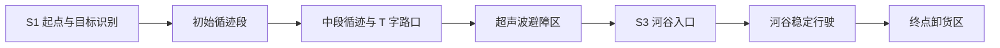
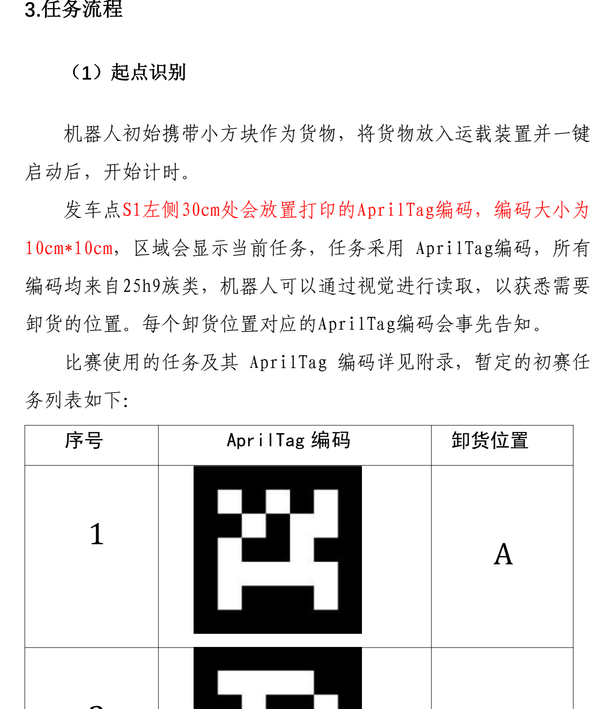

# 赛道路线与任务流程说明

本项目面向一条综合型小车赛道，路线并不是单纯的直线循迹，而是把视觉识别、红外循迹、路口计数、超声波避障、窄路稳定控制和最终投放串在同一趟任务里。为方便公开展示，下面使用抽象化路线描述，不复刻官方赛道图和具体场地尺寸。

> 图片素材来自项目已有规则资料的局部截图，仅用于说明项目任务流程。若仓库公开发布，建议保留为“赛道示意图/任务示意图”用途，不上传完整规则 PDF。

## 赛道总览

从示意图可以看出，路线大致由三类区域组成：

- 起点与循迹区域：小车从 `S1` 出发，通过黑线和十字路口计数确定进度。
- 障碍与检查点区域：中段存在障碍物和 `S2`、`S3` 等恢复检查点。
- 河谷与卸货区域：后半段进入窄路/河谷，最后到达 A/B/C 对应的卸货位置。

## 路线概览

小车从起点出发后，先识别本轮任务目标，再沿黑线前进。赛道中设置了多个十字路口和检查点，小车通过红外传感器识别路口，并用计数结果判断当前处于哪一段任务。中途会经过需要避障的区域和较窄的河谷区域，最后根据起点识别到的目标编号选择卸货动作。

## 分段说明

| 阶段 | 路线特征 | 小车策略 |
| --- | --- | --- |
| S1 起点 | 起点处需要确认本轮投放目标 | 摄像头识别 AprilTag，得到 A/B/C 目标编号，并保存到任务状态 |
| 初始循迹段 | 以黑线循迹和连续路口为主 | 使用四路红外传感器保持在线，十字路口用去抖计数，避免重复触发 |
| 中段循迹段 | 出现需要特殊处理的 T 字路口 | 检测到 T 字路口特征后执行一次固定转向，再继续循迹 |
| 避障区 | 前方可能出现障碍物，单纯循迹不够稳定 | 通过前方和左右超声波判断距离，先执行绕行动作，再寻找线路接回 |
| 河谷段 | 路线较窄，对转向过冲更敏感 | 降低修正强度，用更柔和的左右轮速度差保持稳定通过 |
| 卸货区 | 需要根据目标编号执行最终动作 | 按目标 A/B/C 调整车身方向，继续到停止线后控制舵机完成卸货 |

## 起点识别

起点识别的作用是把“本轮要把货物送到哪里”转化成程序中的 `target_id`。代码在 `S1` 调用摄像头读取 AprilTag，识别结果会映射到 A/B/C 三个卸货位置之一，并写入状态文件。后续即使小车从中途检查点恢复，也能继续使用同一个目标编号，不需要重复扫描。

## 检查点与恢复逻辑

赛道被抽象为几个关键检查点：

- `S1`：任务起点。小车在这里扫描目标码，并从头开始计数。
- `S2`：进入复杂路段前后的中间检查点。用于在调试中快速恢复到中段任务。
- `S3`：避障结束、河谷段开始附近的检查点。用于单独调试河谷和终点投放。

程序会把当前检查点、目标编号、状态阶段和路口计数写入 `mission_state.json`。这样在调试时，如果小车中途停止，不一定要从起点重新跑完整路线，可以从上一个检查点继续验证后半段逻辑。

## 控制难点

### 1. 十字路口重复计数

小车经过十字路口时，四个红外传感器可能会连续多帧都读到黑线。如果每一帧都计数，状态机会很快跑偏。因此程序加入了连续检测阈值和锁定机制：只有连续识别到路口特征后才计一次，并且等传感器离开该路口后才允许下一次计数。

### 2. 避障后重新接线

避障区不能只看红外循迹，因为障碍会迫使小车离开原路线。程序先根据前方距离触发绕行动作，再结合左右超声波读数调整方向。当重新检测到路线特征后，才切换到后续路段。

### 3. 河谷段转向幅度

普通循迹为了快速纠偏，左右轮速度差可能较大。但在窄路或河谷段，过强的纠偏容易导致摆动。因此程序在河谷段单独设置了更柔和的速度表，让小车以较小的修正量通过。

### 4. 目标相关的卸货动作

起点识别到的目标编号会一直保存在任务状态中。到达终点区域后，小车根据该编号决定是否需要预先调整朝向，再运行到停止位置并驱动舵机完成投放。

## 状态机对应关系

代码中的 `flag` 表示当前路线阶段：

| flag | 含义 |
| --- | --- |
| `1` | 初始循迹 |
| `2` | 中段循迹与 T 字路口处理 |
| `3` | 避障与接回路线 |
| `4` | 河谷段稳定行驶 |
| `5` | 终点卸货 |

这种分段方式让每一段路线都有相对独立的控制策略。相比把所有判断写在一个大循环里，状态机更方便调试，也更容易在比赛现场快速定位问题。
